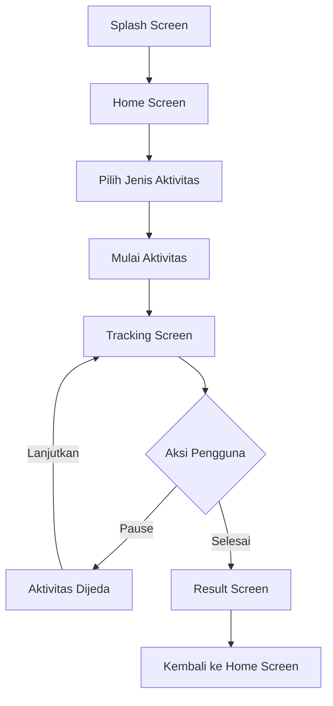

<p align="center">
  

  <h1 align="center">PulseRun</h1>
  <p align="center">
    Aplikasi monitoring aktivitas olahraga sederhana berbasis Flutter,
    accelerometer, gyroscope, dan GPS.
  </p>
</p>

<p align="center">
  
  
  
  
</p>

---

## Ringkasan

**PulseRun** adalah aplikasi mobile yang dibuat untuk membantu pengguna
memantau aktivitas olahraga ringan seperti **jalan kaki**, **jogging**, dan
**lari ringan**. Aplikasi ini memanfaatkan sensor perangkat untuk membaca
gerakan pengguna, menghitung estimasi langkah, membaca lokasi GPS, menghitung
jarak tempuh, menampilkan kecepatan, serta membuat ringkasan hasil aktivitas.

Proyek ini cocok sebagai implementasi pembelajaran **Pengembangan Aplikasi
Bergerak** karena menggabungkan beberapa konsep penting:

- Antarmuka Flutter dengan Material 3.
- Navigasi antar halaman.
- Penggunaan sensor perangkat.
- Permission dan stream lokasi GPS.
- Pengolahan data aktivitas secara real-time.
- Penyajian hasil dalam bentuk ringkasan metrik.

---

## Preview Aplikasi

> Tambahkan screenshot aplikasi pada bagian ini agar dokumentasi terlihat lebih
> lengkap. Simpan gambar di folder `screenshots/`, lalu ubah path gambar di
> tabel berikut.

| Splash Screen | Home Screen |
| --- | --- |
| `screenshots/splash.png` | `screenshots/home.png` |

| Tracking Screen | Result Screen |
| --- | --- |
| `screenshots/tracking.png` | `screenshots/result.png` |

---

## Fitur Utama

### 1. Splash Screen

Saat aplikasi dibuka, pengguna akan melihat halaman pembuka dengan identitas
aplikasi **PulseRun**. Tampilan menggunakan gradasi hijau dan biru untuk
memberikan kesan sehat, aktif, dan modern. Setelah beberapa detik, aplikasi
otomatis masuk ke halaman utama.

### 2. Pemilihan Aktivitas Olahraga

Pengguna dapat memilih salah satu dari tiga aktivitas:

| Aktivitas | Deskripsi | Nilai MET |
| --- | --- | --- |
| Jalan Kaki | Aktivitas ringan untuk kebutuhan harian | 3.5 |
| Jogging | Latihan kardio dengan tempo menengah | 7.0 |
| Lari Ringan | Aktivitas lebih cepat untuk sesi singkat | 8.3 |

Setiap aktivitas memiliki ikon, warna, dan deskripsi yang berbeda agar mudah
dibedakan oleh pengguna.

### 3. Tracking Aktivitas Real-Time

Saat tracking berjalan, aplikasi menampilkan beberapa data penting:

- Durasi latihan.
- Jarak tempuh berdasarkan GPS.
- Kecepatan saat ini.
- Estimasi jumlah langkah.
- Status gerakan.
- Status GPS.
- Koordinat latitude dan longitude.

Pengguna juga dapat menjeda aktivitas, melanjutkan aktivitas, atau menyelesaikan
sesi latihan.

### 4. Ringkasan Hasil Aktivitas

Setelah aktivitas selesai, aplikasi menampilkan halaman hasil yang berisi:

- Jenis aktivitas.
- Total durasi.
- Total jarak.
- Estimasi langkah.
- Kecepatan rata-rata.
- Estimasi kalori.

Estimasi kalori dihitung berdasarkan nilai MET aktivitas, berat badan contoh
60 kg, dan durasi aktivitas.

---

## Teknologi yang Digunakan

| Teknologi | Fungsi |
| --- | --- |
| Flutter | Framework utama untuk membangun aplikasi mobile |
| Dart | Bahasa pemrograman yang digunakan |
| Material 3 | Sistem desain untuk tampilan aplikasi |
| sensors_plus | Membaca accelerometer dan gyroscope |
| geolocator | Mengakses GPS, permission lokasi, jarak, dan kecepatan |

Dependency utama terdapat pada file `pubspec.yaml`:

```yaml
dependencies:
  flutter:
    sdk: flutter
  geolocator: ^13.0.1
  sensors_plus: ^6.1.1
```

---

## Struktur Folder

```text
lib/
|-- main.dart
|-- models/
|   |-- activity_metrics.dart
|   |-- activity_result.dart
|   `-- activity_type.dart
|-- screens/
|   |-- splash_screen.dart
|   |-- home_screen.dart
|   |-- tracking_screen.dart
|   `-- result_screen.dart
|-- services/
|   |-- activity_tracking_service.dart
|   |-- location_service.dart
|   `-- sensor_service.dart
`-- widgets/
    |-- activity_option_card.dart
    `-- metric_card.dart
```

### Penjelasan Struktur

| Folder/File | Penjelasan |
| --- | --- |
| `main.dart` | Entry point aplikasi dan konfigurasi tema utama |
| `models/` | Berisi model data untuk aktivitas, metrik, dan hasil aktivitas |
| `screens/` | Berisi halaman utama aplikasi |
| `services/` | Berisi logika sensor, GPS, dan tracking aktivitas |
| `widgets/` | Berisi komponen UI yang digunakan berulang |

---

## Alur Aplikasi



Alur aplikasi dimulai dari splash screen, kemudian pengguna diarahkan ke halaman
utama. Setelah memilih aktivitas, pengguna masuk ke halaman tracking. Selama
tracking, aplikasi membaca data sensor dan GPS secara langsung. Ketika aktivitas
diselesaikan, aplikasi menampilkan ringkasan hasil.

---

## Cara Kerja Sensor

### Accelerometer

Accelerometer digunakan untuk membaca percepatan perangkat. Pada proyek ini,
data accelerometer dipakai untuk membuat estimasi langkah.

Logika sederhananya:

1. Aplikasi menghitung besar percepatan dari sumbu `x`, `y`, dan `z`.
2. Jika nilai percepatan melewati ambang tertentu, aplikasi menganggap terjadi
   satu langkah.
3. Sistem memberi jeda minimal antar langkah agar hitungan tidak terlalu cepat.
4. Jika percepatan kembali rendah, aplikasi siap menghitung langkah berikutnya.

### Gyroscope

Gyroscope digunakan untuk membaca rotasi perangkat. Data rotasi digabungkan
dengan data accelerometer untuk menentukan status gerakan pengguna.

Status gerakan yang dapat muncul:

- Diam.
- Gerakan ringan.
- Berjalan/Jogging stabil.
- Gerakan aktif.

### GPS

GPS digunakan untuk:

- Memeriksa layanan lokasi perangkat.
- Meminta izin lokasi kepada pengguna.
- Membaca posisi pengguna secara berkala.
- Menghitung jarak antar titik koordinat.
- Mengambil kecepatan saat ini.
- Menampilkan latitude dan longitude.

---

## Cara Kerja Tracking

Logika utama tracking berada pada `ActivityTrackingService`.

Tahapan tracking:

1. Aplikasi memeriksa izin lokasi melalui `LocationService`.
2. Jika izin lokasi tersedia, aplikasi mulai membaca sensor.
3. Aplikasi membaca stream posisi GPS.
4. Timer berjalan setiap satu detik untuk memperbarui durasi.
5. Setiap update sensor memperbarui status gerakan dan jumlah langkah.
6. Setiap update lokasi memperbarui jarak, kecepatan, dan koordinat.
7. Saat pengguna menekan tombol selesai, aplikasi menghentikan sensor dan GPS.
8. Aplikasi membuat objek `ActivityResult` untuk ditampilkan di halaman hasil.

---

## Desain Antarmuka

PulseRun menggunakan gaya visual yang bersih dan modern:

- Warna utama hijau untuk memberi kesan sehat dan aktif.
- Warna sekunder biru untuk memberi kesan teknologi dan tracking.
- Card dengan sudut membulat untuk menampilkan informasi secara rapi.
- Ikon Material untuk memperjelas fungsi setiap bagian.
- Layout berbasis `SingleChildScrollView`, `Column`, `Row`, dan `Wrap` agar
  tampilan tetap nyaman pada layar mobile.

Palet warna utama:

| Warna | Hex | Penggunaan |
| --- | --- | --- |
| Hijau utama | `#179C77` | Tombol, ikon, tema utama |
| Biru sekunder | `#2C7BE5` | Aksen dan gradasi |
| Hijau gelap | `#0E5D65` | Splash screen dan header |
| Teks utama | `#12313A` | Judul dan nilai metrik |
| Latar | `#F6FAFC` | Background halaman |

---

## Instalasi dan Menjalankan Proyek

Pastikan Flutter SDK sudah terpasang, lalu jalankan perintah berikut:

```bash
flutter pub get
```

Jalankan aplikasi:

```bash
flutter run
```

Build APK debug:

```bash
flutter build apk --debug
```

Build APK release:

```bash
flutter build apk --release
```

---

## Permission Android

Karena aplikasi menggunakan GPS, permission lokasi perlu tersedia pada Android.
Package `geolocator` akan membantu proses pengecekan dan permintaan izin lokasi
melalui kode aplikasi.

Status yang ditangani aplikasi:

- GPS belum aktif.
- Izin lokasi ditolak.
- Izin lokasi ditolak permanen.
- Lokasi aktif dan terus diperbarui.

---

## Kelebihan Aplikasi

- Antarmuka sederhana dan mudah digunakan.
- Memiliki alur aplikasi lengkap dari splash sampai hasil aktivitas.
- Menggunakan sensor perangkat secara langsung.
- Menggabungkan data gerakan dan data GPS.
- Cocok sebagai proyek pembelajaran Flutter berbasis sensor.

---

## Keterbatasan

- Hitungan langkah masih berupa estimasi sederhana, bukan pedometer bawaan.
- Estimasi kalori masih memakai berat badan tetap 60 kg.
- Belum memiliki fitur riwayat aktivitas.
- Belum menampilkan peta lintasan.
- Akurasi GPS bergantung pada perangkat dan kondisi lokasi pengguna.

---

## Ide Pengembangan Selanjutnya

- Menambahkan profil pengguna untuk berat badan, tinggi badan, dan usia.
- Menyimpan riwayat aktivitas ke database lokal.
- Menampilkan peta lintasan aktivitas.
- Menambahkan grafik perkembangan olahraga.
- Membuat mode target, misalnya target jarak atau target durasi.
- Menambahkan dark mode.
- Mengembangkan estimasi langkah agar lebih akurat.

---

## Kesimpulan

PulseRun berhasil memperlihatkan penerapan dasar sensor mobile pada aplikasi
olahraga berbasis Flutter. Aplikasi ini menghubungkan antarmuka pengguna,
pengelolaan state, pembacaan accelerometer, gyroscope, GPS, serta pengolahan
hasil aktivitas menjadi satu pengalaman aplikasi yang utuh.

Dengan struktur kode yang cukup jelas, proyek ini dapat dikembangkan lebih jauh
menjadi aplikasi fitness sederhana yang lebih lengkap, personal, dan informatif.

---

<p align="center">
  Dibuat sebagai proyek pembelajaran aplikasi mobile berbasis Flutter.
</p>
